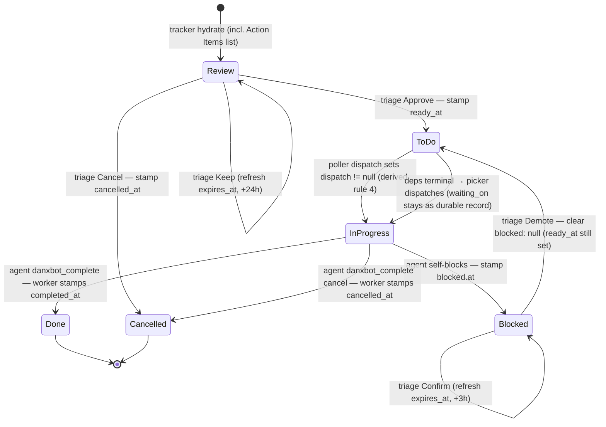

# Issue Workflow

Universal workflow rules for issue cards tracked as YAML files at `<repo>/.danxbot/issues/{open,closed}/<id>.yml`. The danxbot worker mirrors that state to a backend tracker (Trello, Memory) for human visibility on a ~60s poll cycle.

## Source of Truth

**Local YAML is the single source of truth.** Title, description, status, AC, children, comments, retro, blocked, waiting_on, labels — every field on the `Issue` schema lives canonically in `<repo>/.danxbot/issues/{open,closed}/<id>.yml`. The poller dispatches off the local YAML. The danxbot agent path reads + writes the YAML.

**The backend tracker (Trello) is a one-way mirror with two narrow inbound exceptions.**

Outbound (YAML → tracker, every tick):
- Every YAML field — title, description, AC, children, status (list move), labels, comments — is pushed to the tracker so humans see current state.
- The tracker's view is a *projection* of the YAML. Nothing the tracker shows is authoritative.

Inbound (tracker → YAML, narrow):
1. **New cards.** A card created on the tracker that has no matching local YAML gets hydrated into a fresh YAML on the next tick. After hydration, the YAML is the source of truth for that card forever.
2. **New comments.** Human-authored comments on the tracker are pulled into the YAML's `comments[]` so the agent sees them. Comment-author detection distinguishes human vs bot-mirrored comments to avoid echo loops.

**Everything else from the tracker is ignored.** A human dragging a card between lists on the tracker, editing its title, ticking an AC checkbox, etc. has no effect on the local YAML. The next tick re-asserts YAML state and the human's tracker-side edit disappears. If you want a status change, edit the YAML directly with `Edit` / `Write` — the chokidar watcher mirrors the change to the DB on the file event, and the worker's per-tick mirror pushes the new state to the tracker. The tracker is for *viewing* and *commenting*, not for editing card structure.

This is intentional. Two-way sync on every field would create merge conflicts the worker can't resolve. One-way mirror + narrow inbound exceptions = unambiguous semantics.

**Agent path is YAML + `mcp__danx-issue__*` MCP tools only.** The agent never calls a backend tracker SDK directly. The danxbot worker is the sole writer to the backend on its ~60s poll cycle.

## YAML Schema

Authoritative source: `<DANXBOT_REPO>/src/issue-tracker/interface.ts` (the `Issue` type).

Quick reference:

| Field | Type | Notes |
|---|---|---|
| `schema_version` | `10` | Always exactly `KNOWN_SCHEMA_MAX` (currently 10). The boot sweep migrates older files forward at worker startup via the registry under `src/issue-tracker/migrations/`. The validator rejects fail-loud anything outside `[KNOWN_SCHEMA_MAX - 1, KNOWN_SCHEMA_MAX]` (`KNOWN_SCHEMA_MAX - 1` is the defense-in-depth tier handed off inline to `migrateForward`; in practice the boot sweep eliminates that case before any read). Never change at write time. |
| `tracker` | string | Don't change. Implementation-managed. |
| `id` | string (`ISS-N`) | Internal primary key. Filename is `<id>.yml`. Don't change. |
| `external_id` | string | Tracker-native id. Sync-layer only — never expose, never edit. |
| `parent_id` | `string \| null` | Child card → parent's `id`. On phases of an epic = epic's `id`. Reverse linkage to `children[]`. |
| `children` | `string[]` (ids) | Ordered list of child issue ids (`ISS-N`). Available on every card type. On `type: Epic` = the ordered phase cards (UI label "Phases"). On non-epic = sub-cards (UI label "Children"). One field, two labels. Phases MUST be cards — there is no in-card phase checklist (ISS-81 retired the old `phases[]` field). Maintained by `danx-epic-link` skill (human-created phase cards) and by `danx_issue_create` (drafts with `parent_id` set). |
| `dispatch` | `{id, pid, host, kind, started_at, ttl_seconds} \| null` | Poller-managed dispatch record (replaces the bare `dispatch_id`). `null` when no agent is running on the card; non-null is a structured snapshot of the active dispatch (UUID, OS PID + host for cross-host correlation, kind = `"work"` \| `"triage"`, ISO start, liveness TTL in seconds). Don't touch. |
| `status` | `Review` \| `Backlog` \| `ToDo` \| `In Progress` \| `Blocked` \| `Done` \| `Cancelled` | **Derived — agents NEVER write this field.** Computed every read by `deriveStatus()` (`src/issue/derive-status.ts`) from lifecycle timestamps + gate fields. The worker stamps the relevant timestamp on lifecycle transitions; the read path projects that into a status value. Direct status writes in agent skills are FORBIDDEN — see CLAUDE.md "Forbidden Patterns". To move a card, write the trigger field: pickup → worker auto-flips via `dispatch != null`; ready → `ready_at`; complete → `completed_at` (worker stamps on `danxbot_complete({status: "completed"})`); cancel → `cancelled_at`; block → `blocked.at`. |
| `ready_at` | `string \| null` (ISO 8601) | Triage Approve / agent-marks-ready / move into a `ready`-type list → worker stamps. Derived rule 5: populated + no higher-precedence trigger → `ToDo`. |
| `completed_at` | `string \| null` (ISO 8601) | Worker stamps on `danxbot_complete({status: "completed"})` via `stampIssueCompleted`. Derived rule 2 → `Done`. Worker also clears `dispatch: null` at the same write. |
| `cancelled_at` | `string \| null` (ISO 8601) | Triage Cancel / move into a `cancelled`-type list → worker stamps via `stampIssueCancelled`. Derived rule 1 → `Cancelled`. Worker also clears `dispatch: null`. |
| `archived_at` | `string \| null` (ISO 8601) | Move into an `archived`-type list → worker stamps. Derived rule 6 → `Backlog`. Parking back to Backlog REQUIRES `ready_at: null` (rule 5 outranks rule 6). |
| `list_name` | `string \| null` | **Display-only — workers NEVER read this field for state-machine decisions.** Auto-resolved by the worker to the default list of the derived semantic type on every write that changes timestamps. Humans may override by moving the card to any list via the dashboard. The semantic state machine = 100% timestamp + `dispatch` + `blocked.at` + `waiting_on` + `requires_human` + `conflict_on[]` — `list_name` is a pure UI affordance. |
| `type` | `Bug` \| `Feature` \| `Epic` | Required. |
| `title` | string | Card name (no `#ISS-N:` prefix — worker prefixes when pushing). |
| `description` | string | Full markdown body. |
| `triage` | `{expires_at, reassess_hint, last_status, last_explain, ice, history[]}` | Triage agent owns this. `expires_at` is the ISO timestamp at which the poller re-triages the card (`""` forces re-triage on next tick). `last_status` / `last_explain` mirror the most recent `history[]` entry for fast read. `ice = {total, i, c, e}` is the most recent ICE score (`total = i × c × e`). `history[]` is an append-only audit (capped at 10 entries). Leave alone unless you're the triage agent. |
| `ac` | `[{check_item_id, title, checked}]` | Acceptance Criteria. New items: `check_item_id: ""` (worker assigns). |
| `comments` | `[{id?, author, timestamp, text}]` | Append `{author, timestamp, text}` (no `id`) — worker pushes. |
| `retro` | `{good, bad, action_item_ids[], commits[]}` | Fill on Done / Cancelled / Blocked only. Worker auto-renders ONE `## Retro` comment. `action_item_ids[]` is a `string[]` of `ISS-N` references (e.g., `["ISS-12", "ISS-14"]`). Create each action item card first via `danx_issue_create`, then push its returned `id` here. Unknown or malformed `ISS-N` values render as `<ISS-N: unknown>` in the retro comment. **`commits[]` is owned-repo ONLY** — every sha must be reachable from THIS card's repo's `origin/main`. Cross-repo work (plugin edits in `~/web/claude-plugins/`, sibling repos) does NOT belong here; document those shas in a `comments[]` entry naming the external repo + sha(s) + what shipped. DX-559 gate Blocks `danxbot_complete({status:"completed"})` when this rule is violated. |
| `waiting_on` | `null` OR `{reason, timestamp, by[]}` | **Dep-chain dispatch gate, status-independent.** `null` when nothing queues the card. Set to a record when the card is waiting on **other in-flight work** (a phase sibling, an Action Items card, a separately-scoped task). `reason` is a non-empty sentence; `timestamp` is ISO 8601; `by[]` is a non-empty list of `ISS-N` ids that must reach Done / Cancelled before the picker may dispatch this card. If no card describes the unblock work, **create one** (`danx_issue_create`) and reference it. The picker skips dispatch while any id in `by[]` is non-terminal; the field itself is a **durable record** — the system NEVER auto-clears it on dep resolution or status change. Only the agent / operator clears it (when they decide the link was a mistake). **Status-independent — the validator does NOT couple `waiting_on` to any status** (yaml.ts: "Any status legal with any waiting_on shape"). A card may carry `waiting_on` while at `Review`, `ToDo`, `In Progress`, OR `Blocked`. The picker's runtime release path flips an actively-assigned card to `ToDo` + clears `assigned_agent` when a gate re-fires at pickup (multi-agent-pick.ts) — that is a runtime side effect, not a write-time invariant. **Waiting On is NOT Blocked** — see "Blocked vs Waiting On" below. |
| `blocked` | `null` OR `{at, reason}` | **Self-block lifecycle trigger.** `null` when the card itself can proceed. Non-null = the card itself cannot make progress on its own work; a human (or a subsequent agent dispatch) must clear the block. No `by[]` — that lives on `waiting_on`. `at` is ISO 8601 (the timestamp the block was stamped, derived precedence rule 3 → status `Blocked`); `reason` is a non-empty sentence. **Status is derived from `blocked.at`** — populated `blocked.at` → derived status `Blocked`; cleared `blocked: null` → status falls through to the next-precedence trigger. Agents never write `status: "Blocked"` directly. |
| `requires_human` | `null` OR `{reason, steps[], set_by, set_at}` | **Orthogonal "this card needs a human" indicator.** `null` when no human action needed. Non-null = the card cannot make progress until a human acts on something the agent has zero programmatic reach into (3rd-party token rotation, granting access to an external dashboard, manual deploy of external infra). Independent from `blocked` and `waiting_on`; all three are dispatch gates and may co-exist. The poller's dispatch filter (`src/poller/local-issues.ts`) skips any card with `requires_human != null`. `set_by` is `"agent"` (rare 3rd-party blockers) or `"human"` (operator flagged the card via the dashboard). `set_at` is ISO 8601. Cleared by the human via the dashboard's "Mark Resolved" affordance. See "Requires Human vs Blocked vs Waiting On" below. |

## MCP Tool Surface

All under prefix `mcp__danx-issue__*` (note hyphen). Error shape: `{<verb>: false, errors: ["msg", ...]}`.

| Tool | Args | Purpose |
|---|---|---|
| `danx_issue_create` | `{type, title, description, parent_id?, children?, status?, ac?, comments?}` | Allocate next `ISS-N`, build canonical YAML, write to `<repo>/.danxbot/issues/open/<id>.yml`. Returns `{created: true, id, path, external_id}` or `{created: false, errors[]}`. Atomic id allocation needs server-side coordination — this is the only mutation tool agents need beyond `Edit` / `Write`. The worker's orphan-push mirrors the new card to the tracker on the next poll tick. |
| `danx_issue_list` | `{status?, type?, parent_id?}` | **Preferred for any multi-card scan or discovery** (status sweeps, sibling lookups, parent→children walks, "find all blocked", "what's in Review"). Returns `[{id, title, status, type, parent_id}]`. Always reach for this BEFORE hand-globbing the issues dir or guessing ids. |
| `danx_issue_close` | `{id}` | Explicit terminal close (sets `status: Cancelled` if not already terminal, fills retro, moves file `open/` → `closed/`). |

**Reading a single card by id:** `Read .danxbot/issues/open/<id>.yml` directly. Fall back to `closed/<id>.yml` if not found. No MCP wrapper — the YAML is the source of truth and the file path is deterministic.

**Edit semantics:** Edit the YAML directly with `Edit` (preferred — preserves other agents' uncommitted edits) or `Write` for full rewrites. The chokidar watcher (`src/db/issues-mirror.ts` in the danxbot worker) mirrors every file change to Postgres on the file event, and the post-completion auto-sync (`src/worker/auto-sync.ts`) pushes terminal state to the tracker when `danxbot_complete` fires. The worker's per-tick mirror (~60s) is the steady-state safety net for tracker pushes that miss the auto-sync window. There is no agent-facing save verb to call — agents edit the YAML in place and let the worker do the mirroring.

**Status terminal moves:** when the worker stamps `completed_at` or `cancelled_at` (on `danxbot_complete({status: "completed"})` / `danxbot_complete({status: "cancelled"})` respectively) and the dispatch finishes, the worker moves the file `open/` → `closed/` on its next poll as part of the auto-sync. `blocked.at` populated keeps the YAML in `open/` (non-terminal — a human or next dispatch may clear `blocked: null`). Never move the file yourself.

## Status on Creation — ALWAYS start in Review

**Every newly created card MUST be created with `status: "Review"`** — without exception. `Review` is the holding pen for cards that have not yet been audited for scope, quality, or fit. The per-card triage agent (`danx-triage-card`) is the only mover from `Review` → `ToDo`, and it makes that decision against the description + `ac[]` + parent context the human / creating agent left behind.

This applies to:

- Human-typed cards via the dashboard "Create Card" affordance.
- Agent-created cards via `mcp__danx-issue__danx_issue_create` (pass `status: "Review"` explicitly; do not rely on tool defaults).
- Cards created as part of a same-turn epic + phase fan-out (the epic AND every phase card start `Review` — see Phases vs Epics below).
- Action-item cards spawned mid-retro for follow-up work.

**Why.** A card in `ToDo` is dispatchable on the very next poller tick. If the description is half-written, the AC is vague, or the scope overlaps another in-flight card, the poller will hand it to a worker that wastes a dispatch flailing on under-specified work. `Review` forces a single agent (the triage agent — or a human via the dashboard's status patch) to read the card cold and either Approve (→ `ToDo`), Cancel (→ `Cancelled`), or Keep (refresh expires_at, +24h, give the author time to flesh it out).

**Promotion to ToDo is a SEPARATE action, never co-located with creation.** Even when you are sure the card is well-formed and ready, leave it derived `Review` on the create call. The promotion happens via one of:

- Triage agent ICE-scores it Approve and stamps `ready_at = <now ISO>` (derived status `ToDo` via rule 5) — the normal path.
- Human operator promotes it from the dashboard (PATCH writes `ready_at`).
- The CREATING agent, AFTER having (a) finished the description + ac[] in the same turn, (b) verified zero-context-test pass against its own output, and (c) confirmed the card genuinely belongs in the dispatch queue right now, edits the YAML in a SECOND step to stamp `ready_at = <now ISO>`. This two-step pattern (create-in-Review then stamp ready_at) is explicit, intentional, and visible on the card history — it is NOT a shortcut for skipping triage in general. Use this only when you are the creating agent and you are absolutely certain; default is to leave the card to the triage agent.

**Interaction with `waiting_on`.** `waiting_on` is status-independent — a card may carry the dep-chain record at any status (Review, ToDo, In Progress, Blocked). The validator does not couple them. For sequential phase chains, you may stamp `waiting_on.by[]` at creation time alongside `status: Review` and the chain rides through Review → ToDo cleanly; no second-pass edit required. Cards in Review with `waiting_on` populated wait for both triage approval AND every `by[]` blocker to terminate before the picker dispatches.

**Interaction with epic status derivation.** The poller propagates parent epic triggers from its children's derived-status union (see "Epic status is computed, not edited" below). When all phase children derive `Review`, the epic also derives `Review` automatically (rule 4: "All non-cancelled children Review → parent Review"). When the creating agent two-step-promotes some phases by stamping `ready_at`, the parent epic gets its own `ready_at` stamped by the poller (rule 3: "Any child ToDo → parent ToDo"). The agent does NOT manually stamp the epic's triggers — derivation owns them.

## Triage Lifecycle

The `triage{}` block on each YAML is owned by the **per-card triage agent** dispatched by the poller. The poller picks one card per tick whose `triage.expires_at <= now` and dispatches `/danx-triage-card <ISS-N>`. One card per dispatch — the bulk-orchestrator (`/danx-triage`) was retired in Phase 5 of ISS-90.

**Cadence per status (the TTL the agent stamps onto `triage.expires_at`):**

| Derived status | Triage decision | Trigger write | Default TTL |
|---|---|---|---|
| `Review` | ICE-score → Keep / Cancel / Approve | Keep: refresh `triage.expires_at` only (no trigger write). Cancel: stamp `cancelled_at = <now ISO>` + retro. Approve: stamp `ready_at = <now ISO>` (and optionally populate `requires_human`). | 24h |
| `Blocked` (`blocked.at != null`) | Hard Gate audit → Demote OR Confirm | Demote: clear `blocked: null` (derived status falls through to next trigger). Confirm: refresh `triage.expires_at` + write `reassess_hint`. | 3h |
| `Waiting On` (`waiting_on != null`) | Re-check `waiting_on.by[]` — clear if every dep is terminal | Clear: `waiting_on: null` (no trigger write needed; status independent). | 1h |
| `ToDo` / `In Progress` | Not triaged | n/a | n/a |
| `Done` / `Cancelled` | Terminal — never re-triaged | n/a | n/a |

**ToDo dispatch sort** is **untriaged first** (`triage.expires_at === ""` — never been scored) **then triaged by `triage.ice.total` DESC**. ICE = Impact × Confidence × Ease, each axis 1-5, total ranges 1-125. Within each tier, FIFO by mtime. The poller's `listDispatchableYamls` enforces this order; agents do not need to think about ranking themselves — write a good description and the triage agent's ICE score governs priority.

**`Action Items` is not a status concept.** Cards on the Trello "Action Items" list hydrate as `status: Review` so the per-card triage agent picks them up alongside the Review list. The list itself stays on the board as a UX bucket; the YAML stores `status: Review`.

**Triage state machine (derived statuses; transitions = trigger writes):**



`requires_human` is set by humans (via the dashboard "Flag for human"
affordance) or by the triage agent (Approve decision — populates the
field with a clear `reason` + `steps[]`). The poller never moves
`requires_human` automatically; it only reads the field as a dispatch
gate. Cleared by humans only via "Mark Resolved".

## Blocked vs Waiting On

Two different states for "this card cannot proceed right now":

- **Blocked** (stamp `blocked: {at: <now ISO>, reason: <one sentence>}`; derived status becomes `Blocked` via rule 3): the card itself cannot complete on its own work — typically because **a human must act**. Credentials, deploy, secrets rotation, ambiguous spec needing a human design call, architectural decision that changes the goal of the card, write-only repo. The card sits at derived `Blocked` until a human (or a subsequent agent dispatch) clears `blocked: null`. **Invariant: `blocked.at !== null` ⇒ derived status is `Blocked`** (rule 3). Agents never write `status: "Blocked"` directly — stamp the trigger, the read path derives the status.
- **Waiting On** (`waiting_on: {reason, timestamp, by[]}`): the card is queued behind **other in-flight work** that does NOT need a human — phase siblings shipping first, an Action Items card landing, a separately-scoped task. The poller auto-unblocks and dispatches the card once every dependency in `by[]` reaches Done / Cancelled. `waiting_on` is status-independent; the field may coexist with any open status. NEVER set `status: "Blocked"` AS A SUBSTITUTE for `waiting_on` — they model different causes; if a sibling-card-wait is the only cause, populate `waiting_on` only.

When the unblock work itself needs a human, the right shape is: keep this card on `waiting_on`, and put the human task in a NEW `Blocked` card referenced from `waiting_on.by[]`. The original card auto-unblocks the moment the human-task card moves to Done / Cancelled.

**All four dispatch gates may coexist on one card simultaneously — by design.** `blocked`, `waiting_on`, `requires_human`, and `conflict_on[]` each model a different real-world cause; the picker AND-s them and dispatches only when every gate is null/empty. A card may legitimately carry all four at once (e.g. queued behind a prior phase AND conflicting with a sibling AND blocked on a design decision AND awaiting a 3rd-party token rotation). Each gate is cleared by a different actor / event independently — see `issue-blocker/SKILL.md` "Field selection" table for the routing rules + the example clearance timeline. The ONLY enforced derived-status linkage is `blocked.at !== null ⇒ derived status is Blocked` (rule 3 of `deriveStatus`). `waiting_on`, `requires_human`, and `conflict_on[]` are fully status-independent — populate freely regardless of derived status.

**Picking up a Blocked / Waiting On card → invoke the `unblock` skill first.** Same applies if the card you are about to start **overlaps** an existing Blocked card (same parent epic, same key files, same domain) — surface the dependency before doing work that the upstream resolution may invalidate. `unblock` produces the operator playbook; once the human acts and reports back, resume normal `issue-card-workflow` for the AC update.

## Blocked — Hard Gate Before Saving

Before stamping `blocked: {at: <now ISO>, reason: <one sentence>}` (which makes the derived status `Blocked` via rule 3) you MUST name the **specific human-only resource** that blocks completion. Pick exactly one:

| Allowed reason | Example |
|---|---|
| Credential / secret rotation | API key only humans hold |
| Deploy access | Push to a write-only / human-only environment |
| Write-only repo / external tracker | No agent path to mutate |
| Design / product decision | Ambiguous AC needs human spec call |
| Physical / OOB action | Reset hardware, contact vendor, sign legal doc |

If you cannot name one — **status stays `In Progress` and you do the work.** "Operator should verify in production", "human should run these commands and report back", "live operator-driven runs are the only honest way" are NOT valid reasons. If the verification step is `.env` edit + `artisan` + `make` + `yarn` + log grep, the agent runs it.

**Rationalization detector — if your `Blocked` comment / `blocked.reason` contains any of these phrases, you are punting (don't stamp `blocked.at` — fix in-session):**
- "operator-driven verification"
- "production-shaped infra"
- "honest way to verify"
- "intermittent — needs more samples" (run more samples yourself)
- "needs to be tested in production / staging"
- "operator must run `/reload-plugins`" / "active sessions need to reload" / "restart open editors" / "re-source shell" — plugins + configs reload on next session by design; transient session refresh is NEVER a work product. Mark such ACs done if every persistent artifact (commit pushed, file written, package published) is in place.
- "operator must verify in their environment" — when verification is not gating any other work, ship the card; if verification later fails, file a new card.

Strip the punt, run the steps, report the result, update the AC.

## Local-First Execution Rule

**Cards execute + validate in the local Sail environment by default.** Local is intended to be identical to production in every meaningful way. Code, schema, migrations, config defaults, queue, Octane, MCP servers, Pusher, danxbot — all reproducible locally.

A card may target staging / production ONLY when the card's scope IS environment-specific:
- Deploy infra change (Dockerfile, compose, k8s manifest, CI/CD)
- Secret / credential rotation
- Production data migration that cannot run on local fixtures
- Monitoring / alerting wiring that consumes the production telemetry pipe

Reproducing a bug, validating a fix, running an artisan suite, capturing logs, running Pint / vitest / phpunit — all local. If you find yourself writing "verify in staging" on a card whose subject is application code, rewrite the verification step against local.

If local genuinely cannot reproduce, that is a SEPARATE bug — file an action-item card to fix the local-vs-prod divergence rather than punt the original card to staging verification.

## Requires Human vs Blocked vs Waiting On

Three different "this card cannot dispatch right now" signals. They are
NOT interchangeable; the dashboard surfaces them as three distinct
indicators and the poller checks them as three independent gates. Pick
the right one mechanically — guessing produces noisy operator queues.

| Signal | Field | When | Cleared by |
|---|---|---|---|
| **Blocked** | `blocked: {at, reason}` (derived status `Blocked` via rule 3) | The card *itself* is stuck — a human must **supply information / take an action the agent does not have** but COULD perform if it had it (credentials, deploy access, ambiguous spec needing a design call, missing decision input, write-only repo the agent cannot reach). | Human writes a comment / opens the card; next dispatch (or human) clears `blocked: null` — derived status falls through to the next-precedence trigger (`ready_at` → ToDo, etc). |
| **Requires Human** | `requires_human: {reason, steps[], set_by, set_at}` (any derived status) | The card needs a human to act on a **system the agent has zero programmatic reach into** — 3rd-party API token rotation, granting access to an external dashboard, manual deploy of external infra. Independent from `blocked` / `waiting_on`. | Human via the dashboard's "Mark Resolved" affordance (PATCHes `requires_human: null`). Re-enables dispatch on the next poll tick. |
| **Waiting On** | `waiting_on: {reason, timestamp, by[]}` (status independent) | The card is queued behind **other in-flight work** that does NOT need a human — phase siblings shipping first, an Action Items card landing, a separately-scoped task. | Picker dispatches the card the moment every blocker in `by[]` reaches Done / Cancelled. The `waiting_on` record itself stays on the card as a durable dep-history note. |

### Why three signals instead of one

Operators triaging the parked-card list need to know what kind of
unblock action is required at a glance. Collapsing them into one
"parked" bucket loses signal:

- **Blocked** is a request for *information / a decision*. The
  unblock action is short, often answerable from a comment.
- **Requires Human** is a request for *external action*. The
  unblock action requires the human to leave the dashboard and
  touch a vendor portal / keyring / other system; it cannot be
  resolved by typing.
- **Waiting On** is *no human action at all* — the poller will
  unblock the card automatically when the dependency chain
  resolves; surfacing it as "needs human" is noise.

### When to use each — examples

| Scenario | Right signal |
|---|---|
| Agent picks up card, AC says "use the Stripe API" but no Stripe key is in `.env` | **Requires Human** — operator must rotate / install a 3rd-party key the agent cannot get itself. |
| Agent picks up card, finds the spec ambiguous between two architectures | **Blocked** — human supplies a design decision. |
| Agent picks up card, finds the test suite is failing on a file the card does not touch (after exhausting in-session fixes) | **Blocked** — human must debug or redirect. |
| Phase 5 of an epic; Phase 4 just shipped but Phase 5 needs the schema bump from Phase 3 which has not landed yet | **Waiting On** with `by: ["<phase-3-id>"]`. |
| Triage detects the card describes a manual SaaS dashboard config the agent cannot perform | **Requires Human** (set during triage as part of the Approve decision). |
| Card is implementable but the chosen direction is high-risk and the agent wants a sanity check | **Requires Human** with `reason: "Direction needs sign-off"` + `steps: ["Confirm direction in design doc"]`. (Triage Approve.) |

### Coexistence

`requires_human` is fully independent of `blocked` and `waiting_on` and
may coexist (rare). Example: a card that is both `Blocked` (waiting on a
clarifying comment) AND has `requires_human` set (waiting on a token
rotation that the operator will do as part of clearing the block). The
poller checks each gate independently; clearing all three is required
to dispatch.

### Whitelist / blacklist for `requires_human`

The full whitelist + blacklist for when an agent may set
`requires_human` lives in the `danxbot:requires-human` plugin skill
(load via the Skill tool before populating the field). The condensed
form: **whitelist** = 3rd-party token rotation, external dashboard
access, manual deploy of external infra, anything the agent has zero
programmatic reach into. **Blacklist** = ambiguous spec, failing test,
merge conflict, missing local dependency, clarifying question — those
are `Blocked`, not `requires_human`.

### Termination contract for agent-set `requires_human`

When an agent **sets** `requires_human` mid-dispatch (the field flips
from `null` to populated during this session), the dispatch ends with
`danxbot_complete({status: "completed", summary: "Set requires_human — see field"})`. The agent does NOT also flip `status` to a terminal value
and does NOT fill `retro` — the human is the next actor and the field
is the only signal needed. The poller skips the card on every
subsequent tick until the human clears the field; when they do, a
fresh dispatch picks it up at whatever status it was at and continues.

Humans can also set `requires_human` directly via the dashboard's
"Flag for human" affordance (`set_by: "human"`) when they want to
park a card on an external action they will perform later.

## Card Titles

`[Project > Domain] verb phrase` for features. `Fix:` prefix for bugs. Phase cards: `Epic Title > Phase N: Description`. Keep under ~80 chars.

## Effort Levels (`effort_level` field, DX-509/DX-511/DX-512)

Every card carries an `effort_level` slot on its YAML — a 7-rung ladder (`min`, `very_low`, `low`, `medium`, `high`, `very_high`, `max`) that maps to a `(model, effort)` pair the dispatch layer uses to size the worker. The mapping table and the operator-tunable assignment policy live in the workspace's auto-rendered `.claude/rules/danx-effort-policy.md` (the inject pipeline re-writes that file every tick from `<repo>/.danxbot/settings.json` so operator edits propagate without a restart).

**When creating a card:** read `.claude/rules/danx-effort-policy.md` and pick the lowest level that can plausibly complete the card. Default to `medium` when uncertain; lean DOWN, not up. Mechanical rule of thumb — bump UP only when the card genuinely needs deeper reasoning (multi-file refactor, architectural decision, subtle concurrency, novel domain modelling); bump DOWN aggressively for mechanical edits, single-file fixes, doc tweaks, well-scoped renames, additive endpoints with no business logic.

**When picking up a card:** if `effort_level` is unset (`null`), set it per the policy file BEFORE flipping `status` to `In Progress`. See `danx-next/SKILL.md` Step 1 for the pickup sequence.

**When triaging a Review card:** validate `effort_level` is sensible for the work the description implies. Unset or mismatched → set / correct it per the policy file. See `danx-triage-card/SKILL.md` `Status = Review` for the audit step.

## Card Descriptions (`description` field)

Must pass **zero-context test** — fresh agent with no conversation history can implement from description alone. No code blocks — prose only.

**Feature:** Context (what exists, why change) → Solution (high-level approach) → Key files.

**Bug:** Problem (what's broken) → Root Cause (why, or "TBD") → Solution (what to change) → Key files.

Every description must include: exact file paths, known gotchas, how to verify. Update with investigation findings when picking up a card (Edit the YAML's `description` field — the chokidar watcher mirrors the change to the DB; the post-completion auto-sync pushes to the tracker).

## Checklists

**`ac[]` (Acceptance Criteria, required):** Specific, verifiable items starting with a verb. "Returns 422 when email missing" not "Handle validation."

**Forbidden AC shapes — do NOT add these in the first place:**
- "Active host-session instances run `/reload-plugins`" / "operator restarts open editors" / "operator re-sources shell rc" / "operator reloads browser tabs" — plugins + configs reload on next session by design. Transient session refresh is NEVER a work product. If the persistent artifact (commit pushed, file written, package published) is in place, the work is done.
- "Operator verifies in their environment" — agent has no way to verify, verification gates nothing else. Ship the card; file a new card if it later breaks.

If you catch yourself authoring such an AC, drop it. ACs gate Done; transient operator nicety does not.

There is no separate "Progress" or "Phases" checklist on the YAML schema (ISS-81 retired the old `phases[]` field). Multi-step work either fits in `ac[]` on a single card OR splits into an Epic + child phase cards (`children[]`). Progress lives in the agent's pipeline (TDD test pass, code review pass, commit) and is reflected on terminal save via `completed_at` (worker-stamped) + `retro.commits[]`.

`update_checklist_item` analogue: Edit `ac[i].checked: true` (match by exact `title` text — `check_item_id` may be empty for new items the worker hasn't synced yet). The chokidar watcher mirrors the change to the DB; the per-tick mirror pushes the AC state to the tracker.

## Reading a Card

Always read full context before starting:
- `description`
- ALL `comments[]` (every entry, oldest first)
- `ac[]` (with verification status)
- `children[]` (look up each child YAML — those are the phase cards on epics, sub-cards otherwise)
- `triage.last_status` / `triage.last_explain` (if non-empty — the most recent triage decision)

`Read .danxbot/issues/open/<id>.yml` (fall back to `closed/<id>.yml`) returns the full YAML. Never work from title alone.

## Creating a Card != Implementing It

**Spawn → DONE.** Don't implement, don't pick up, don't start work. The card hands work to a different agent in a different session. After `danx_issue_create`, only valid actions: tell user the card was created (show `ISS-N`), continue previous work, or stop.

**Always create with `status: "Review"`.** See the "Status on Creation" section above. The triage agent is the default mover from `Review` → `ToDo`; the creating agent only promotes via the explicit two-step pattern when it has finished the description + ac[] in the same turn AND it is certain the card belongs in the dispatch queue right now. Never pass `status: "ToDo"` to `danx_issue_create`.

## CRITICAL: Never Check Off an Unverified AC Item

Before setting `ac[i].checked: true`, must have direct evidence: passing test, command output, verified runtime result. "By construction" / "obviously correct" are NOT evidence. Cannot verify an AC item in current environment → leave `checked: false` and say so — never check off with an excuse for why verification was skipped.

## Card Lifecycle

**Pick up:** The worker auto-flips status to derived `In Progress` by setting `dispatch != null` on the candidate YAML BEFORE spawning the agent (DX-584 dispatch core auto-flip + rule 4). The agent does NOT write `status:` on pickup. First agent edit is `effort_level` (if unset per `danx-effort-policy.md`). Read full context (description, all comments, all AC, children, labels-equivalent via `type`). Plan work.

**During:** Append review results / discoveries to `comments[]`, save. AC checklist edits flip `ac[i].checked: true` with direct evidence.

**Complete:** Agent fills `retro.{good, bad, action_item_ids, commits}` and calls `danxbot_complete({status: "completed", summary})`. The worker stamps `completed_at = <now ISO>` via `stampIssueCompleted`, clears `dispatch: null`, renders the `## Retro` comment, moves the file `open/` → `closed/`, and pushes terminal state. Derived status becomes `Done` via rule 2. Agent never writes `status: Done` directly.

**Reopen (terminal → dispatchable):** Reverse the terminal trigger, do NOT touch the `status:` field. Reopening a Done card = clear `completed_at: null` AND stamp `ready_at: <now ISO>`; reopening a Cancelled card = clear `cancelled_at: null` AND stamp `ready_at: <now ISO>`. Derivation rule 5 then produces `ToDo` and the worker moves the file `closed/` → `open/` automatically on the next chokidar event. The `status:` field is round-trip persistence only — the worker rewrites it from the derived value on every save. Writing `status: ToDo` directly is the violation; the trigger fields ARE the API.

| Reopen scenario | Trigger writes (atomic, same edit) |
|---|---|
| Reopen Done card | `completed_at: null` + `ready_at: <now ISO>` + `list_name: ToDo` (display only) |
| Reopen Cancelled card | `cancelled_at: null` + `ready_at: <now ISO>` + `list_name: ToDo` |
| Reopen back to Review (not dispatchable yet) | clear terminal trigger + leave `ready_at: null` (rule 7 falls through to raw `status: Review`) |

NEVER write the `status:` field as part of a reopen. NEVER `mv` the YAML file by hand — the worker owns file location and re-derives it from the triggers on the next event.

## Completion contract — `completed` means EVERYTHING on the card is done (DX-654)

`danxbot_complete({status: "completed"})` is NOT a per-dispatch "I'm done for now" signal. It is a per-card "this card is finished, every promise it made has shipped" signal. Two hard preconditions, both required, every time:

1. **Every `ac[i].checked` is `true`**, each with direct evidence per Step 1.1 of the danx-next flow (test passed, command output, quoted code line). Unchecked AC = unfinished work. There is no "the rest are minor" or "the remainder will land in a follow-up" exemption — every AC item was defined as required at triage.
2. **Every child in `children[]`** (when non-empty) is in a terminal status (`Done` / `Cancelled`). A phase parent whose children are still ToDo / In Progress / Blocked / Waiting On is NOT complete; the rollup happens via derive-status, not via a direct write.

If either condition fails, you have three options — all of them keep this dispatch's terminal signal honest:

- **Finish the remaining work in-session.** Default. Apply the Step 1.5 fix-it-yourself filter from `danx-next`. If you could plausibly finish in the remaining 10–30 minutes, do it.
- **Split into a fresh sibling card** if the residue is genuinely separate scope. The current card narrows its AC set to what landed; the new card carries the residue. Document the split in a `comments[]` entry.
- **Move to Blocked / Waiting On** if a real human action or external dependency gates the remainder (per Step 10 / 10b of `danx-next` — read the no-false-blockers patterns first).

**`danxbot_complete({status: "completed"})` on a `type: Epic` candidate is FORBIDDEN.** Epic terminal state is DERIVED from child terminal states (rollup), never written directly. A planning-style dispatch whose candidate IS the epic (split-into-phases pattern) ends with `danxbot_complete({status: "completed"})` ONLY when every phase child is already terminal — which is rare in practice, since planning dispatches typically split-and-handoff rather than split-and-rollup. In the common case the planning dispatch should:

- Confirm every phase card exists with `parent_id` linked and its own AC + waiting_on chain stamped.
- Leave the epic at its derived `In Progress` state (or whatever the rollup resolves to).
- Call `danxbot_complete({status: "completed"})` — the worker's write-side guard (`stampTerminal` in `src/issue/stamp-terminal.ts`) refuses to stamp `completed_at` on a `type: Epic` YAML and surfaces a `stamp-terminal-epic-refused` system error if you bypass this rule. The dispatch row still finalizes normally; only the YAML mutation is suppressed.

The guard is defense-in-depth — the rule above is the contract you uphold. If you reach the guard, you tripped over the rule.

## Phases vs Epics

**One concept: `children[]`** (ISS-81). On `type: Epic` cards, `children[]` is the ordered list of phase cards (UI label "Phases"). On non-epic cards, `children[]` is sub-cards (UI label "Children"). Phases MUST be cards — there is no in-card phase checklist.

**Small multi-step work → ONE card with `ac[]`.** Each AC item is a discrete deliverable. No need to split if everything fits in a single commit-able session.

**Large multi-step work → Epic + child phase cards.** `type: Epic` on the parent. Each phase is its own full card (own `description`, own `ac[]`, own commit, own retro). Epic stays In Progress while phases work; flips Done when all children reach Done.

**When to split into epic:** Each phase looks like substantial work (multiple files, own tests, full session). Smaller related tasks → keep as `ac[]` items on one card.

**Combine adjacent phases when possible (DX-512).** Three good phases beat seven mediocre ones. Every phase costs a dispatch: a fresh worker, a fresh context load, a fresh review cycle, a fresh commit. Before adding a phase, ask "does the combined unit still fit one TDD pass + one commit?" — if yes, combine and keep it as a single phase card. Phase fan-out is a cost multiplier; treat it like adding a dependency, not like adding a checklist item.

**CRITICAL: An epic without its phase cards is INVALID and a workflow violation.** A `type: Epic` YAML with empty `children[]` is never an acceptable end-state for any turn. The instant you create the epic, you create every phase card in the SAME response — no "phases sketched in description, will split later," no "wait for user to confirm phases," no "user only asked for the epic." Phase split lives in your head while you wrote the epic body; persist it to disk before the turn ends.

If a user prompt looks like it asks for "just an epic," it does not. Read it as "epic + every phase card" — that is the unit of work. Asking the user "want me split phases now?" after writing the epic is the violation; do not do that.

**Epic mechanics:** Set epic's `type: Epic` (no `status:` literal — creation defaults derive to `Review`; the worker leaves `ready_at`/`completed_at`/`cancelled_at`/`blocked` all null so rule 7 falls through to the raw `status` field which `danx_issue_create` writes as `Review`). In the SAME turn spawn all phase YAMLs (`Epic Title > Phase N: Description`), each with its own description / `ac[]` / `type` and the same creation default (all derive to `Review`). Set each phase's `parent_id` to the epic's `id`. Append each phase's `id` to the epic's `children[]`.

Sequential-phase `waiting_on` chains may land at creation time — `waiting_on` is status-independent, so a phase card may carry derived `Review` + `waiting_on: {by: [<prior-phase>]}` together. The creating agent stamps the `by[]` chain in the same pass it writes the phase YAMLs; no second-pass edit required. The picker holds each phase off dispatch until both triage approves (Approve stamps `ready_at` → derived `ToDo`) AND every `by[]` blocker reaches a terminal state. Planning agent has full context — capture into phase cards NOW, not later.

### Epic status is computed, not edited (ISS-98)

A parent's derived status (Epic OR any non-epic with non-empty `children[]`) is **derivation-owned by the poller**. Every tick the poller walks every YAML with non-empty `children[]` and writes the parent's lifecycle triggers (`completed_at`, `cancelled_at`, `blocked`) so the union of children's derived statuses propagates correctly. Manual edits to a parent's status / triggers are **overwritten on the next tick** — there is no manual override.

Priority rules (first match wins):

1. Any child derives `Blocked` → parent stamped `blocked: {at, reason}` (worker synthesizes the parent's record on promote, clears on demote — preserves rule 3).
2. Any child derives `In Progress` → parent derives `In Progress` (worker mirrors via parent's own `dispatch` or rule fallthrough).
3. Any child derives `ToDo` → parent stamped `ready_at` (rule 5).
4. All non-cancelled children derive `Review` → parent derives `Review`.
5. All non-cancelled children derive `Done` → parent stamped `completed_at` (rule 2).
6. All children derive `Cancelled` (no exclusion) → parent stamped `cancelled_at` (rule 1).

Cancelled children are excluded from rules 4 and 5 — a single non-cancelled child shifts the answer. Rule 6 fires only when EVERY child is Cancelled. Mixed terminal states (e.g. `Review` + `Done` with no `Cancelled`) leave the parent's current status untouched.

Parent rollup ignores the orthogonal `requires_human` field — that
field is checked only at dispatch time, not propagated. The dashboard
surfaces a child-count subscript on epic children lists when any
phase has `requires_human != null`.

**Implications for agents:**

- When you finish a phase card, call `danxbot_complete({status: "completed"})` — the worker stamps the phase's `completed_at`, which derives the phase to `Done`. The poller propagates the parent epic's trigger on its next tick. Do **not** touch the epic yourself — your edit will be overwritten.
- When a phase stamps `blocked.at`, the parent epic's `blocked` record is synthesized by the poller. The operator triages from the parent's view; no need to also stamp the epic by hand. (Phase `requires_human` is NOT propagated — surface it on the epic children list instead.)
- An Epic stays in whatever state derivation produces. Stamping `completed_at` on an Epic with one child still derived `In Progress` is a no-op and the next tick clears it.
- Parents with `waiting_on != null` are skipped by parent-status derivation — the parent's own dep-chain note takes precedence over derivation from children. Set the parent's `waiting_on` record explicitly when needed; derivation doesn't fight it.

**Forbidden end-states for any turn that creates an epic:**
- Epic written, `children: []`, no phase YAMLs on disk.
- Epic written, phase split listed only in description prose, no phase YAMLs on disk.
- Epic written, "phases TBD" / "left for triage" / "will split next session" anywhere in the response.

If you find yourself about to end a turn in any of those states — stop and write the phase cards first.

**Where phase cards go:** Same derived status as parent epic at creation time. Epic derives Review → phase cards derive Review. Epic derives In Progress → phase cards inherit via their own triggers. Phase cards move with the epic through lifecycle.

**After completing each phase card:** Fill `retro.{good, bad, action_item_ids, commits}`, call `danxbot_complete({status: "completed"})`. The worker stamps `completed_at`, clears `dispatch: null`, renders the `## Retro` comment, spawns action-item cards, and moves the file `open/` → `closed/`. Do **not** edit the epic yourself — the poller propagates the parent's triggers from its children's derived statuses on the next tick (see "Epic status is computed, not edited" above). The next phase card's notes go in `comments[]` per the rule below; once all phase cards derive Done, the poller stamps the epic's `completed_at` automatically.

**CRITICAL: Update next phase card before ending session.** Append a "Notes from Phase N" entry to the next phase card's `comments[]` and save. Capture: discovered constraints, timing gotchas, reusable helpers + paths, cost/budget observations, dependencies between phases, corrections to the description. Assume the next agent reads ONLY `description` + `comments[]` — not epic handoff, not conversation history, not git log.

## Comment Formats

All comments append to `comments[]` as `{author, timestamp, text}` (no `id` — worker assigns).

**Use markdown.** `description`, `comments[].text`, `retro.good`, `retro.bad` all render as markdown in the dashboard's Issues drawer (via `MarkdownEditor` / `CodeViewer`). Use `##`/`###` headers, fenced code blocks (```ts, ```yml, ```bash), bullet/numbered lists, tables, links, **bold**, `inline code`, blockquotes. File paths + symbols → backticks. Multi-line code → fenced. Diffs → ```diff. Plain prose is acceptable but worse — readers skim formatted content faster, and the drawer's renderer already pays the parser cost. Don't escape markdown to "play it safe."

**Retro** (filled in `retro.{good, bad, action_item_ids, commits}` fields, NOT as a manual comment): worker renders ONE `## Retro` comment automatically on terminal save (Done / Cancelled / Blocked). Re-saving with edited retro fields → worker edits the same comment in place. `action_item_ids[]` entries are resolved to their card titles and rendered as `- {title} ({ISS-N})` bullets; unknown ids render as `<ISS-N: unknown>`.

**Bug Diagnosis** (bug cards): Problem, Root Cause, Solution. Either prepend to `description` or append as a `comments[]` entry titled `## Bug Diagnosis`.

**Review:** Summary of findings + fixes. Append as a `comments[]` entry titled `## Code Review` / `## Test Review` / `## Review Fixes`.

## The Card IS the Plan

Issue card assigned (`ISS-N`): never use `EnterPlanMode`, never invoke `writing-plans` or `executing-plans` skills. The YAML's `description` + `ac[]` + `children[]` + `comments[]` ARE the plan. Re-Read `.danxbot/issues/open/<id>.yml` after context compaction, when unsure what's left, before marking Done.

## Backend Tracker

Backend tracker (Trello today; could be others later) is owned by the danxbot worker. Backend-specific config (board IDs, list IDs, label IDs) lives in:

- `<repo>/.danxbot/config/trello-backend.md` (project-specific) — consumed only by the worker.

Agents do NOT read backend config and NEVER call `mcp__trello__*` tools. If a user pastes a Trello URL or short link, look up the matching local YAML by `external_id` field via `mcp__danx-issue__danx_issue_list({})`, then proceed by `id` (`ISS-N`).

## General Rules

- One card at a time
- Don't block on tracker sync failures — the worker retries on next poll; the YAML is canonical
- `type: Bug` or `type: Feature` minimum (or `Epic`) — required
- Comments = markdown with `##` headers
- AC lives in `ac[]` — never inline in `description`. Phases / sub-cards live in `children[]` as `ISS-N` references; each child has its own YAML.
- `retro.action_item_ids[]` must contain only valid `ISS-N` format strings (e.g., `ISS-1`, `ISS-42`). No free text. Create the card first, then push the id.
- Connected repo cards reference the connected repo's architecture (not danxbot's paths)
- NEVER call `mcp__trello__*` from agent path
- NEVER manually move YAML files between `open/` and `closed/` — terminal `status` triggers the worker move
